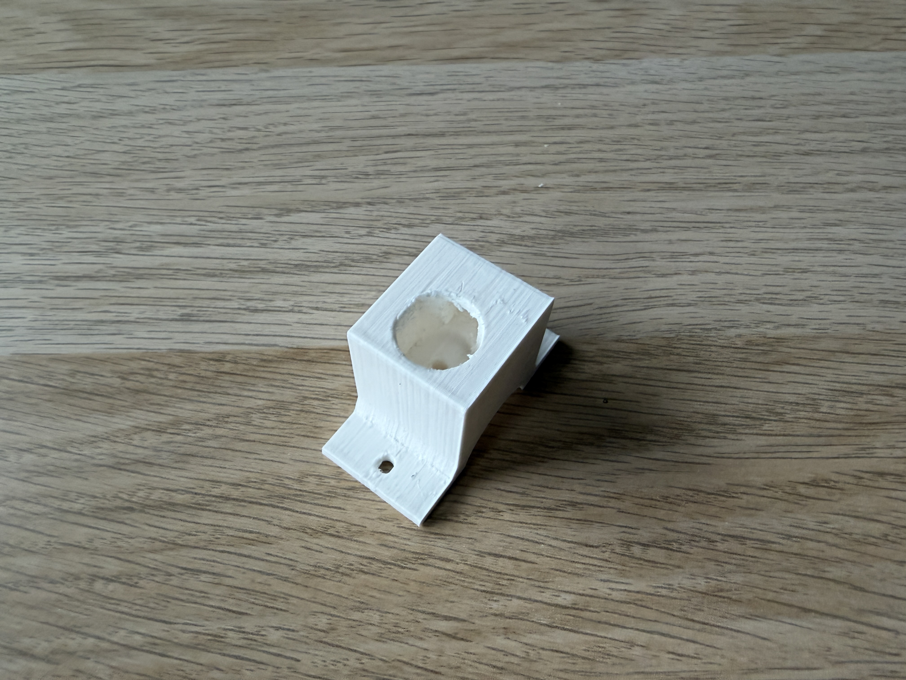
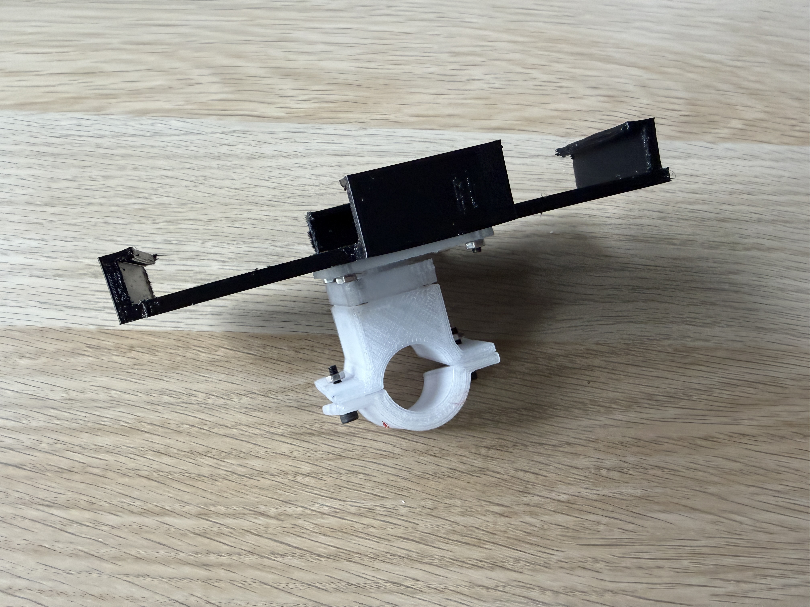
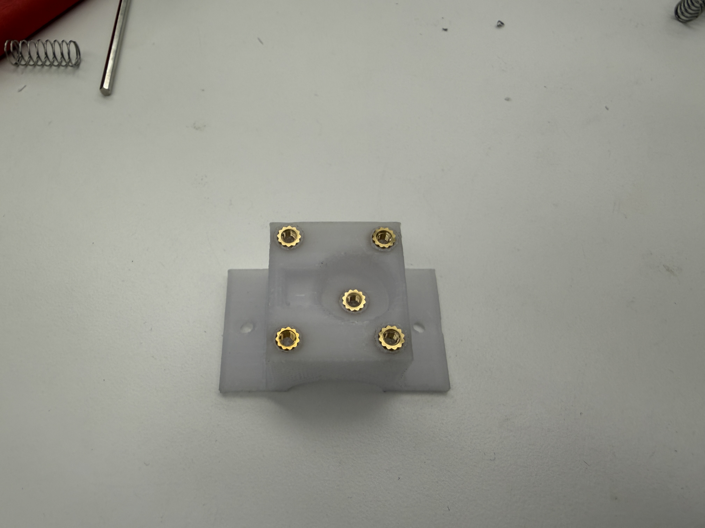
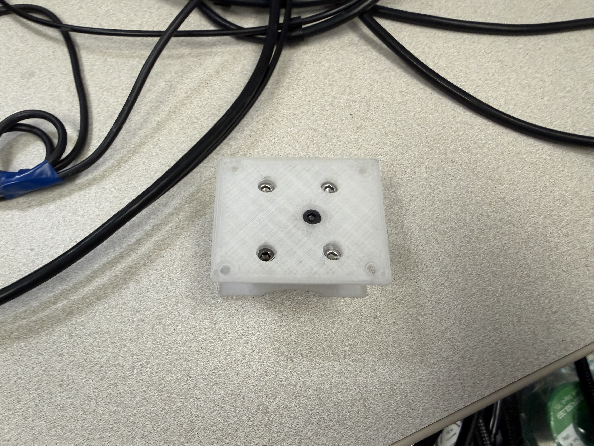
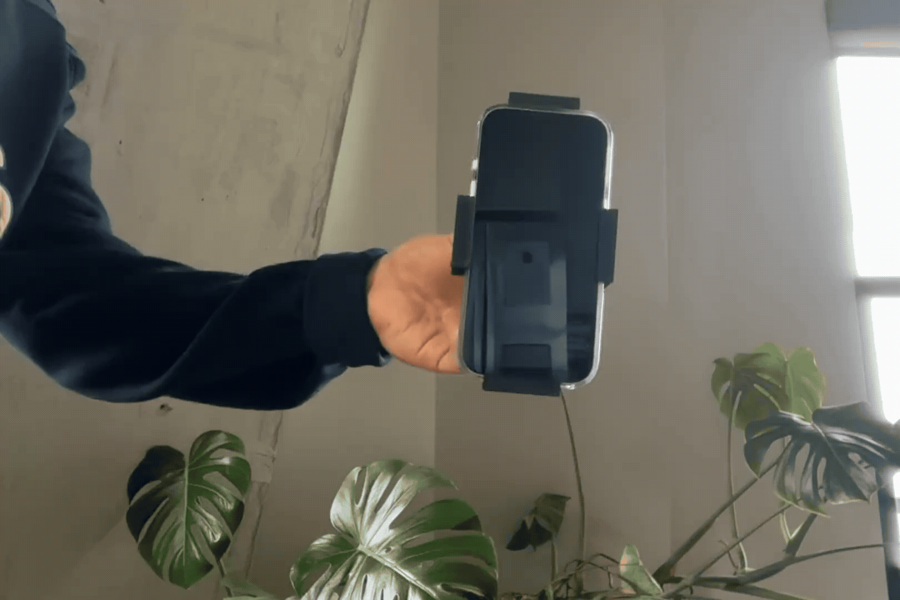
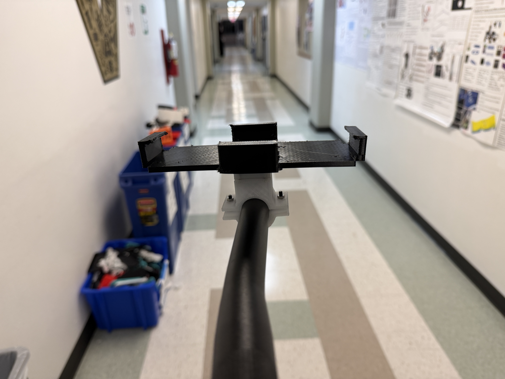
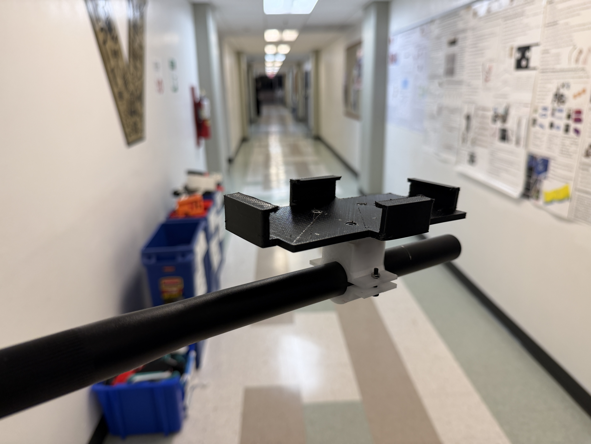
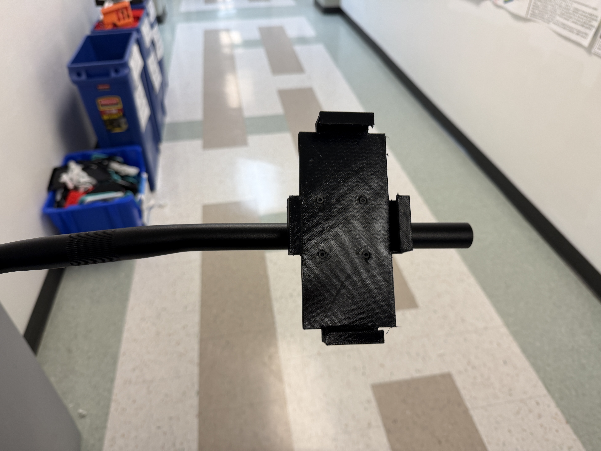

This project made use of top-down modeling in Fusion 360 to design a bike phone mount. In top-down modeling, individual components are created within the context of the full model (in the same file). This allows parts to be designed based on their relationship to each other, something that is very difficult to do when components are in separate files. For any assembly, this method also makes editing components, such as changing dimensions, much faster because changes can be viewed in the context of the full assembly and use case.

In this project, top-down modeling was leveraged to design the phone mount around the actual bike handlebars and the phone that would be used. The handlebars and phone were modeled and the assembly was then created in the same file around them. Each part of the phone mount was created as an individual component, designed in relation to the others.

---

# Design Rationale

### Design Philosophy
I aimed to keep the phone mount as compact as possible. Many bikes have limited space left on their handlebars because grips, handlebar tape, and brake/shifting assemblies take up a lot of room. I wanted a minimal, clean design that stays close to the handlebars to reduce wobbling, minimize movement during bumps, and keep the phone better secured.

### Rotation Mechanism
I used a detent rotation mechanism to allow the phone to be positioned in both portrait and landscape orientations. A cutout in the base of the mount holds a spring pushing against a steel ball. The part that attaches to the phone slots into the base in a cylindrical shape and has small notches cut into it every 90 degrees. As the phone is rotated, the ball and spring snap into the notches to hold it in position.

### Multiple Materials
After the first prototype, I realized that multiple materials were needed: a rigid material for the base/clamp and a flexible one to hold the phone. This mostly affected the phone holder component. I measured my phone with calipers and designed a tight fit with generous overhangs around the edges to securely grip it. Using 95A TPU allowed the phone holder to flex slightly so the phone could snap in while still being held tightly.

---

# Design Iterations

### First Iteration

My first iteration proved to have many problems, but was a good starting point and one I learened a lot from. As mentioned above, I realized the phone mount should be made of a soft material (I could not get my phone into this iteration). I also learned that my whole assembly was too small. I somehow managed to be able to fit a spring and ball in and have my detent mechanism work. The design of the detent mechanism here proved to be an issue later.

### Second Iteration

In this version, I redesigned the phone holder using TPU. This required splitting it into two parts: a rigid insert that attaches to the base and a flexible TPU phone holder. I also doubled the width of the assembly to make it more stable.

However, I ran into a new issue: I couldn’t assemble the detent mechanism because the spring and ball couldn’t be installed after inserting the rotation shaft.

### Third Iteration

To solve that, I redesigned the detent mechanism by splitting the top portion of the base into a separate lid. This allowed me to insert the spring and ball, then secure it with M3 bolts and heat-set nuts. I also widened the body to provide clearance for the hardware. This was also when I switched to PETG instead of PLA for better durability and flexibility.

I also minorly updated my phone holder to account for my new iPhone 17 Pro's huge camera bump. 

---

### Printing Technology and Material Choices
I used filament-based FDM 3D printing for all prototypes because it allowed for fast iteration and a choice of materials (PLA, PETG, and TPU). TPU was used only for the flexible phone holder, while PETG was used for rigid, durable components.

| Part | Printing Technology | Material | Reason |
|------|---------------------|----------|--------|
| Clamp Base | FDM | PETG | Rigid, yet not brittle |
| Clamp Lid | FDM | PETG | Rigid, yet not brittle |
| Phone Mount Base | FDM | PETG | Rigid, yet not brittle |
| Phone Holder | FDM | 95A TPU | Flexible for easy insertion of phone |

---

# Assembly & Use Instructions

### Assembly
1. Heat sink nuts into clamp base, shown below
   

2. Fit phone mount base into clamp lid and place spring and ball inside
   

3. Use M3 (8mm) bolts to attach clamp lid +  phone mount base into clamp base.
4. Use M3 (16mm) bolt to secure phone mount base into clamp base.
5. Use M3 bolts and nuts to fit TPU phone holder to phone mount base.

### Use instructions
1. Use M3 bolts and nuts to secure assembly to handlebars
2. Slip phone into holder

---

# Interactive CAD Model

<iframe src="https://a360.co/4rhvgvq"
        width="800" height="600"
        allowfullscreen="true"
        frameborder="0"></iframe>

---

# Figures

### Final Assembly on Handlebars

### Individual CAD Components

Clamp Base with lid:

Clamp Base without lid:

Phone Mount:

TPU Phone Holder:

---